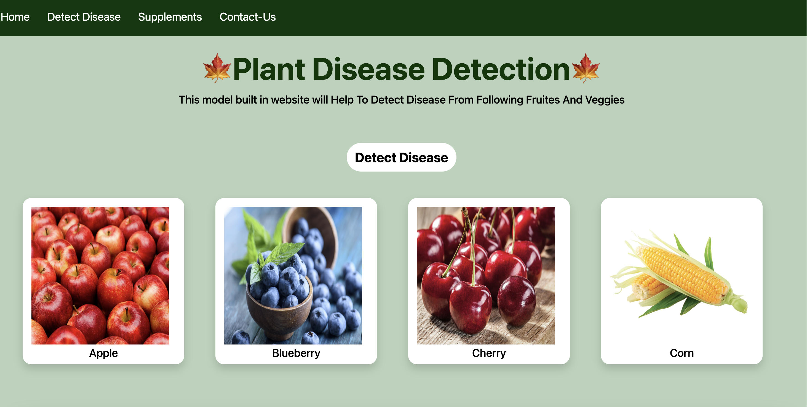
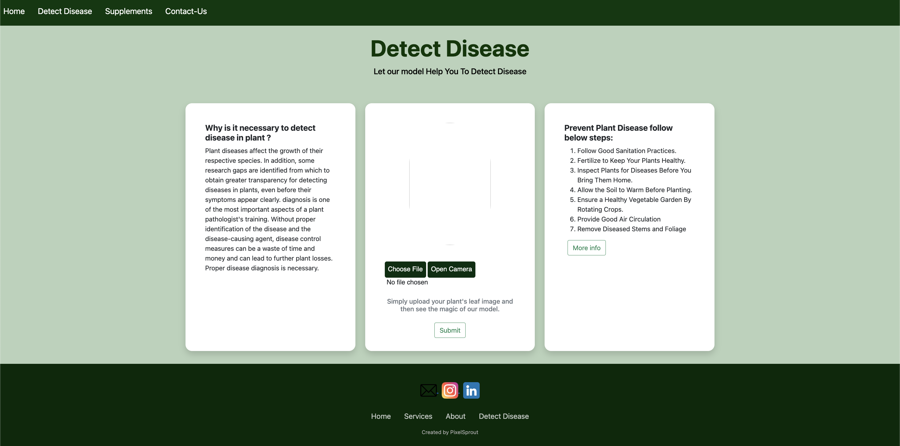
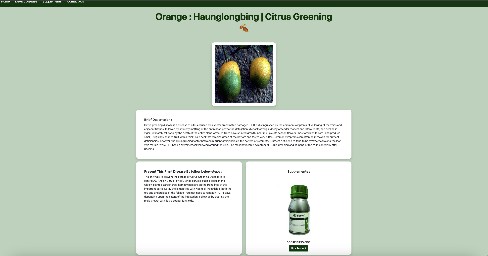
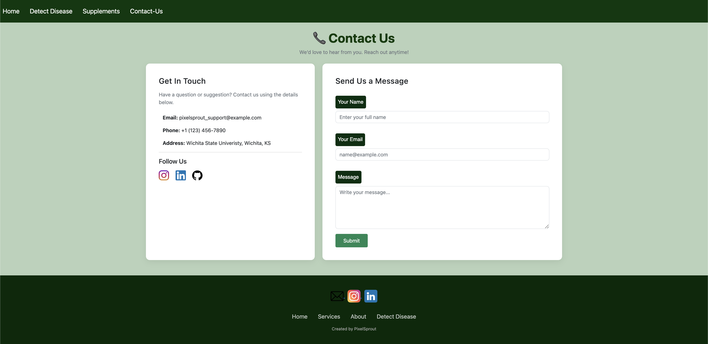

# 🌱 Plant Disease Detection using Deep Learning

[](https://www.python.org/downloads/)
[](LICENSE)
[](https://www.tensorflow.org/)
[](https://github.com/spMohanty/PlantVillage-Dataset)
[](https://arxiv.org/abs/1511.08060)

**Detect plant diseases from leaf images with high accuracy using Convolutional Neural Networks (CNN) built in PyTorch.**

This project classifies plant leaf images into **39 categories** (38 disease/healthy classes + 1 background class) using a custom CNN model. It helps farmers and agriculture enthusiasts identify diseases early and take preventive actions.


## 👨‍🎓 Authors

### Rajeet Chaudhary
- MS Computer Science, Wichita State University
- j992y875

### Lata KC
- MS Computer Science, Wichita State University
- e232f633

### Nabin KC
- MS Computer Science, Wichita State University
- w755k755


**Report**: [Plant Disease Detection (PDF)](./Plant%20Disease%20Detection.pdf)

## 🚀 Features
- Deep learning model trained on the **PlantVillage dataset**
- Web application built with **Flask** for easy image upload and prediction
- Model saved in `.pt` format (PyTorch)
- Supports real-time inference via browser
- Open-source and beginner-friendly for contributions
- Includes test images for quick verification

## 📊 Dataset
We use the **PlantVillage Dataset** (extended version with background class):

- **Total images**: ~61,486
- **Classes**: 39 (including healthy leaves, various diseases across crops like Apple, Tomato, Potato, etc., plus a "Background without leaves" class)
- **Source**: [Mendeley Data – Plant Leaf Diseases Dataset](https://data.mendeley.com/datasets/tywbtsjrjv/1)

Many popular versions of PlantVillage have 38 classes (excluding background); this project uses the 39-class version that includes background images.

## 🛠️ Technologies Used
- **Framework**: PyTorch
- **Model**: Custom Convolutional Neural Network (CNN)
- **Backend**: Flask (for web deployment)
- **Frontend**: Simple HTML + CSS + JavaScript
- **Language**: Python 3.8+

## 🚀 How to Run the Project Locally

1. **Prerequisites**
   - Python 3.8 installed
   - Git (to clone the repo)

2. **Clone the repository**
   ```bash
   git clone https://github.com/YOUR_USERNAME/Plant-Disease-Detection.git
   cd Plant-Disease-Detection


3. Create & activate virtual environment
        ```Bash

        python3 -m venv venv

        source venv/bin/activate   

        # On Windows: 

        venv\Scripts\activate
        ```
4. Install dependencies
        ```Bash
        pip install -r requirements.txt
        ```

5. Train / Generate the model (if you don't have the .pt file)
Go to the Flask Deployed App folder (or wherever your training notebook is)

6. Open and run the .ipynb file (Jupyter Notebook) to train and save plant_disease_model_1.pt

7. Place the model file
Copy plant_disease_model_1.pt into the Flask Deployed App folder

8. Run the Flask web appBashcd "Flask Deployed App"
python3 app.py→ Open http://127.0.0.1:5000 in your browser

Alternative: Play with the model in Jupyter
Use the downloaded pre-trained model from the Model section
Open the notebook and test predictions


## 9. Testing the Model

No leaf images? Use the sample images in the test_images folder. Each image filename indicates the actual disease/healthy class — perfect for verifying model predictions

## 🌐 Web App Screenshots

### Main Page


### AI Engine / Upload Page


### Prediction Result


### Fertilizer/Supplements Store


### Contact Us



🤝 Contributing

This project is open source under Apache 2.0.
Contributions are welcome!

Ideas for contribution:

1. Improve UI/UX of the Flask app
2. Enhance model accuracy (try transfer learning: ResNet, EfficientNet, etc.)
3. Add more features (remedies suggestion, multi-language support, mobile version)
4. Improve README, documentation, or add video demo
5. Fix bugs or optimize code

Steps:

1. Fork the repository
2. Create your feature branch (git checkout -b feature/amazing-feature)
3. Commit your changes (git commit -m 'Add some amazing feature')
4. Push to the branch (git push origin feature/amazing-feature)
5. Open a Pull Request

**Please ensure your code runs without errors and update the .md, .pdf, or .ipynb files if you improve the model.**

## License 📜
This project is licensed under the **Apache License 2.0**. You are free to use, modify, and distribute it (even commercially), as long as the original copyright and disclaimer are included.


## 💬 Contact & Support

Feedback, questions, or collaboration opportunities are welcome.

⭐ If you find this repository useful, please consider giving it a star!

Happy farming & coding! 🌾🔥
